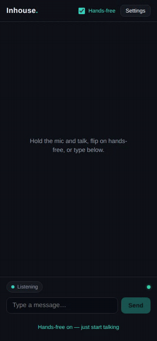
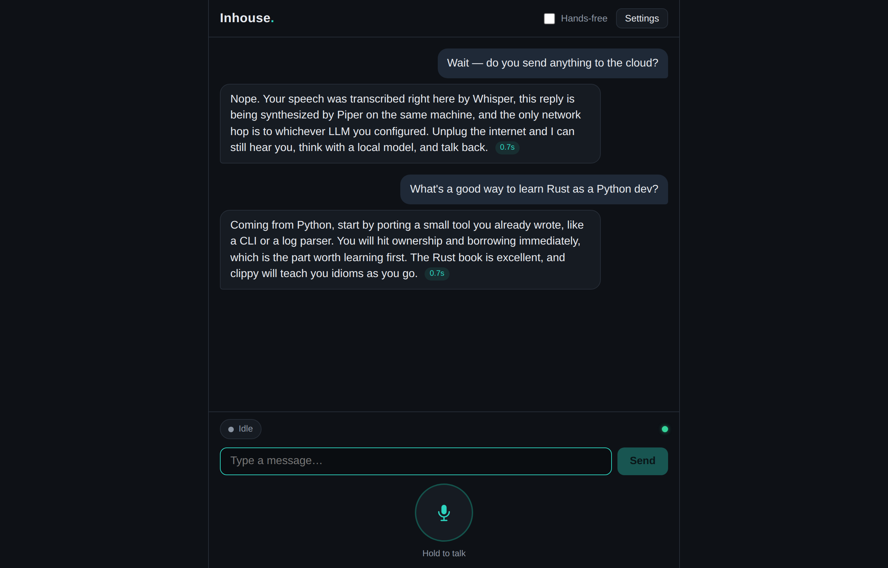

# Inhouse

[](LICENSE)
[](#)
[](https://buy.polar.sh/polar_cl_6jjSshnPGiKpVBok0fIPy6MCf7P5cSiRMLzhi2N6n8K)

**The in-house voice assistant. Your hardware, your models, your conversations.**

Inhouse is a self-hosted voice assistant starter kit: talk to any LLM — local
or hosted — from your phone or desktop browser, with speech recognition and
speech synthesis running entirely on hardware you own. Everything an assistant
normally outsources to someone else's cloud is done *in house*: no cloud voice
APIs, no wake-word appliance listening to your living room, no per-minute
pricing, no funnel into a platform. One small server, one installable web app,
and a kit of adapters you can extend.

**👉 [Try the interface right now](https://getinhouse.org/demo/)** — the real
app with a simulated assistant, running entirely in your browser. Nothing to
install, nothing sent anywhere. (The real assistant can't be hosted for you —
that's the point of it.)

## The map — what runs where

| Surface | Where it runs | What it is |
|---|---|---|
| [getinhouse.org](https://getinhouse.org) | Public web | The brochure. Static page, explains the product. **Not** the assistant. |
| [getinhouse.org/demo](https://getinhouse.org/demo/) | Public web, *in your browser tab* | The real app UI with a scripted assistant — try the interface before installing. |
| `server/` + `web/` (this repo) | **Your** hardware | The product: FastAPI server + installable PWA. Private by construction — there is no hosted version, which is why the public site can't *be* the assistant. |
| [Inhouse Pro](PRO.md) | Your hardware | Paid add-ons + production playbooks for the day it becomes infrastructure. |

<p align="center">
  
  &nbsp;&nbsp;
  
</p>
<p align="center"><sub>Left: a real hands-free turn recorded end-to-end — VAD → local Whisper → LLM → local Piper.</sub></p>

```
 your voice ──▶ browser PWA ──▶ FastAPI server ──▶ faster-whisper (local STT)
                                       │
                                       ▼
                          any LLM (Ollama / OpenAI-compatible / Anthropic)
                                       │ streamed sentence by sentence
                                       ▼
 your speakers ◀── streaming WAV ◀── Piper TTS (local, starts speaking
                                      before the model finishes writing)
```

## Why Inhouse

- **Self-hosted end to end.** STT (faster-whisper) and TTS (Piper) run locally
  on CPU. The only network dependency is whichever LLM *you* choose — and with
  Ollama, even that stays on your machine.
- **Engineered for latency.** The reply is synthesized sentence-by-sentence
  while the LLM is still streaming, and the browser starts playback while the
  server is still synthesizing. You hear the first words of the answer long
  before the answer exists.
- **Provider-agnostic by design.** Three small adapter interfaces (STT, LLM,
  TTS). Ship implementations: local whisper, any `/v1/audio/transcriptions`
  endpoint, any `/v1/chat/completions` endpoint (Ollama, OpenAI, vLLM,
  LM Studio, Groq, OpenRouter), native Anthropic, local Piper, any
  `/v1/audio/speech` endpoint. Writing your own is ~50 lines.
- **A real client, not a curl example.** Installable PWA with push-to-talk,
  hands-free voice activity detection, gapless streaming playback, text
  fallback, and a settings panel — phone-first and tested.
- **Production posture.** Bearer-token auth, loopback-by-default binding,
  systemd unit with sandboxing, Docker Compose with Ollama, retention sweeps
  for recordings, session persistence across restarts, and a hardening guide.
- **Tested.** 33 backend tests, 27 frontend tests, and an end-to-end script
  that speaks a question into the pipeline with real STT/TTS and validates the
  audio that comes back.

## Quick start

**Step 0 — no install:** [the interface demo](https://getinhouse.org/demo/)
shows you what you're building toward in thirty seconds.

**Hear the real pipeline in ~5 minutes — no LLM, no API keys.** The bundled
mock model means your first conversation needs nothing configured: your mic →
local Whisper → mock LLM → local Piper → your speakers.

```bash
git clone https://github.com/getinhouse/inhouse && cd inhouse
make setup          # python venv + npm install
make voice          # download a Piper voice (~60 MB)
make build          # build the PWA (served by the python server)
cp .env.example server/.env   # voice path + sane defaults

server/.venv/bin/python scripts/mock_llm.py &          # offline stand-in LLM
cd server && INHOUSE_LLM__BASE_URL=http://127.0.0.1:9001/v1 \
  INHOUSE_LLM__MODEL=mock .venv/bin/python -m inhouse
# → http://127.0.0.1:8770 — open it, hold the mic, say hello.
#   (mic works on localhost; use TLS for phones — one line, below)
```

**Then give it a real brain.** Any OpenAI-compatible endpoint or Anthropic;
fastest local path is Ollama — `server/.env` already targets it on `:11434`:

```bash
#   ollama pull llama3.2
cd server && .venv/bin/python -m inhouse
```

### Phone access in one line

```bash
tailscale serve --bg --https=8443 http://127.0.0.1:8770
```

Open `https://<machine>.<tailnet>.ts.net:8443`, add to home screen, talk.
See [deploy/HARDENING.md](deploy/HARDENING.md) before any other topology.

## Configuration

Everything is environment variables (or `server/.env`) — see
[.env.example](.env.example) for the annotated full list and
[docs/providers.md](docs/providers.md) for per-provider recipes including
Ollama, OpenAI, Groq, Anthropic, and hosted whisper/TTS endpoints.

## Architecture

[docs/architecture.md](docs/architecture.md) covers the turn pipeline, the
sentence assembler, the streaming-WAV broker, the audio gate that rejects
silence before it costs you an STT pass, and the whisper-hallucination guard.

## Project layout

```
server/   FastAPI app, adapters, pipeline, 33 tests
web/      React PWA (Vite + TS strict), VAD + barge-in + streaming playback, 27 tests
deploy/   systemd unit, Dockerfile, docker-compose (with Ollama), hardening
scripts/  mock LLM, end-to-end smoke test
docs/     architecture & provider cookbook
```

## Inhouse Pro

The core is complete and stays MIT. [Inhouse Pro](PRO.md) ($59 one-time) adds
the Production Deployment Pack — step-by-step playbooks for VPS+Tailscale,
Docker+Caddy on a public domain, and home-server LAN deployments, plus a
troubleshooting matrix, priority issues, and all future Pro content.

## License

MIT. Use it, fork it, build your product on it.
